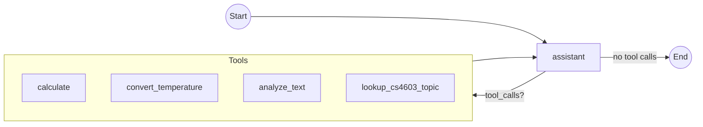
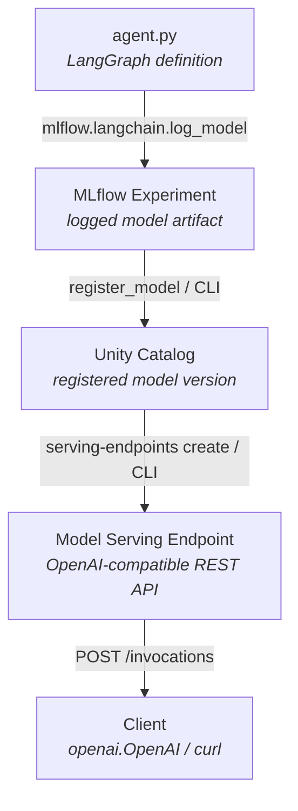

# 11. Databricks Deployment

Deploy a LangGraph agent as a **Databricks Model Serving endpoint** — packaging the graph with MLflow and serving it via the same OpenAI-compatible API used throughout the course.

## Files

| File | Purpose |
|------|---------|
| `agent.py` | Self-contained LangGraph CS4603 study assistant with 4 tools (calculate, temperature conversion, text analysis, course topic lookup). MLflow serializes this file directly via models-from-code. |
| `deploy_setup.sh` | **CLI deployment script** — uses Databricks CLI for model registration and endpoint management. |
| `deploy_setup.py` | Python deployment script — alternative to the shell script; uses the Python SDK. |
| `deployment.ipynb` | Interactive notebook walkthrough of the full deployment pipeline (define → log → test → register → serve → call). |
| `streamlit_app.py` | Chat UI to talk to the deployed serving endpoint via the OpenAI-compatible API. |

## Prerequisites

1. **Databricks CLI (v1.x, the new Go-based CLI)** installed and authenticated:
   ```bash
   # Windows (recommended):
   winget install --id Databricks.DatabricksCLI -e

   # macOS / Linux:
   brew tap databricks/tap && brew install databricks

   databricks auth login --host https://<your-workspace>.databricks.com
   ```

   > **Do not use `pip install databricks-cli`.** That installs the deprecated
   > legacy CLI (v0.18.x), which lacks the `serving-endpoints` command and will
   > fail with `Error: No such command 'serving-endpoints'`. If a legacy
   > `databricks.exe` is present in your venv (`.venv-cs4603\Scripts\`), remove it
   > so it doesn't shadow the real CLI. Note also that the Databricks VS Code
   > extension bundles its own CLI, but that is only on PATH inside VS Code's
   > integrated terminal — installing the standalone CLI above makes `databricks`
   > available in every terminal. Confirm with `databricks --version` (expect v1.x).

2. **Python environment** with project dependencies:
   ```bash
   uv venv -n .venv-cs4603
   .venv-cs4603\Scripts\activate        # Windows
   source .venv-cs4603/bin/activate     # macOS/Linux
   uv pip install -r requirements.txt
   ```

3. **`.env` file** at the repo root with:
   ```
   DATABRICKS_TOKEN="dapi..."
   DATABRICKS_HOST="https://<workspace-id>.databricks.com"
   DATABRICKS_MODEL="databricks-qwen35-122b-a10b"
   ```

4. **Authenticate and set up a CLI profile** for the workspace you want to
   deploy to. Do this **before** running the deployment script:
   ```bash
   # Log in and create a named profile (interactive browser login)
   databricks auth login --host https://<your-workspace>.databricks.com --profile my-profile

   # Verify the profile works
   databricks auth profiles
   databricks current-user me --profile my-profile
   ```
   The deployment scripts use `.env` by default (so students can run the
   notebooks unchanged), but you can force deployment to use this profile with
   the `--profile` flag (see below). The profile takes precedence over the
   `DATABRICKS_HOST`/`DATABRICKS_TOKEN` values in `.env`.

## Deployment Steps

### Option A — Shell Script (Databricks CLI)

The recommended approach. Run from the **repo root**:

```bash
bash wk5_langgraph/11.databricks_deployment/deploy_setup.sh
```

**What it does:**

| Step | Action | Tool |
|------|--------|------|
| 1 | Resolve your Databricks username | `databricks current-user me` |
| 2 | Log the agent model to MLflow | Python (minimal inline — no CLI equivalent) |
| 3 | Register the model in Unity Catalog | `databricks registered-models create` / `databricks model-versions create` |
| 4 | Create or update the serving endpoint | `databricks serving-endpoints create` / `update-config` |

**Options:**

```bash
# Custom model name and endpoint:
bash wk5_langgraph/11.databricks_deployment/deploy_setup.sh \
    --model-name main.default.my_agent \
    --endpoint-name my-agent-endpoint

# Skip endpoint creation (just log + register):
bash wk5_langgraph/11.databricks_deployment/deploy_setup.sh --skip-endpoint
```

### Option B — Python Script

Make sure you have authenticated and created a CLI profile first (see
Prerequisites step 4).

```bash
# --api-key is REQUIRED: a PAT for the target workspace's serving endpoints.
python wk5_langgraph/11.databricks_deployment/deploy_setup.py --api-key dapi...
python wk5_langgraph/11.databricks_deployment/deploy_setup.py --api-key dapi... --model-name my_agent --skip-endpoint

# Deploy using a specific Databricks CLI profile instead of .env:
python wk5_langgraph/11.databricks_deployment/deploy_setup.py --profile my-profile --api-key dapi...
```

The `--profile` flag routes both the Databricks SDK and MLflow
(tracking + Unity Catalog registry) through the named profile in
`~/.databrickscfg`, overriding the `.env` credentials for that run.
The `--api-key` flag is **required** and supplies the personal access token
(PAT) the agent's LLM client uses to call the target workspace's model serving
endpoints — needed because an OAuth profile (`databricks auth login`) has no
static token for model inference.

### Option C — Interactive Notebook

Open `deployment.ipynb` in VS Code or Databricks and run cells sequentially. This is best for learning — each step is explained inline.

## Architecture

### Agent Graph



### Deployment Pipeline



## Verifying the Deployment

**Check endpoint status:**
```bash
databricks serving-endpoints get cs4603-langgraph-agent
```

**Test with curl:**
```bash
curl -X POST "${DATABRICKS_HOST}/serving-endpoints/cs4603-langgraph-agent/invocations" \
  -H "Authorization: Bearer $DATABRICKS_TOKEN" \
  -H "Content-Type: application/json" \
  -d '{"messages": [{"role": "user", "content": "Convert 100F to Celsius"}]}'
```

**Test with Python:**
```python
import openai

client = openai.OpenAI(
    api_key=DATABRICKS_TOKEN,
    base_url=f"{DATABRICKS_HOST}/serving-endpoints",
)

resp = client.chat.completions.create(
    model="cs4603-langgraph-agent",
    messages=[{"role": "user", "content": "What is RAG in the context of LLMs?"}],
)
print(resp.choices[0].message.content)
```

**Chat UI (Streamlit):**

```bash
streamlit run wk5_langgraph/11.databricks_deployment/streamlit_app.py
```

Set the host, token, and endpoint name in the sidebar (defaults are read from
`.env`). Point them at the workspace where the endpoint is deployed — if you
deployed with `--profile`, use that workspace's host and a PAT for it.

## Troubleshooting

| Issue | Fix |
|-------|-----|
| `DATABRICKS_HOST must be set` | Create a `.env` file at the repo root (see Prerequisites) |
| `databricks: command not found` | Install the standalone CLI: `winget install --id Databricks.DatabricksCLI -e` (Windows) or `brew install databricks` (macOS/Linux), then `databricks auth login`. Reopen your terminal to refresh PATH. |
| `Error: No such command 'serving-endpoints'` | You're on the deprecated legacy CLI (v0.18.x). Remove any pip `databricks-cli` / `.venv-cs4603\Scripts\databricks.exe`, install the standalone v1.x CLI, and verify with `databricks --version`. |
| Endpoint stuck in `NOT_READY` | Wait a few minutes — first cold start takes time; check logs in Databricks UI under Serving |
| `PERMISSION_DENIED` on UC | Ask your workspace admin for `USE CATALOG` + `CREATE MODEL` on the target catalog/schema |
| Model logging fails | Ensure `agent.py` imports cleanly: `python -c "import importlib.util; s=importlib.util.spec_from_file_location('a','agent.py'); m=importlib.util.module_from_spec(s); s.loader.exec_module(m)"` |
